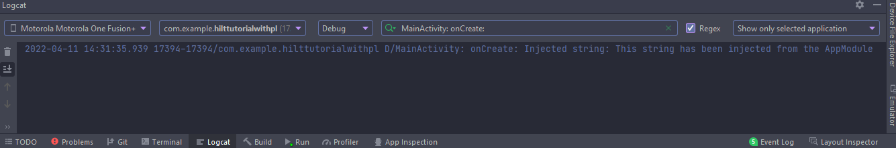
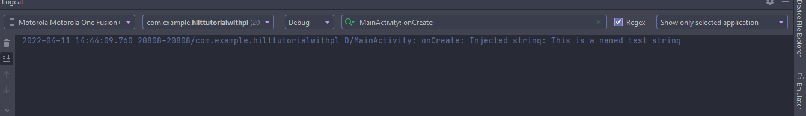

# Notes: Dagger-Hilt with Phillip Lackner

Course URL: [Dagger-Hilt with PL](https://www.youtube.com/watch?v=ZE2Jkvnk2Bs)

<!-- markdownlint-disable MD010 -->

## Sections

- [Notes: Dagger-Hilt with Phillip Lackner](#notes-dagger-hilt-with-phillip-lackner)
  - [Sections](#sections)
  - [Notes](#notes)
  - [Setup](#setup)
    - [Project level gradle file](#project-level-gradle-file)
    - [App level build.gradle file](#app-level-buildgradle-file)
  - [Additional Information](#additional-information)
  - [Errors](#errors)
    - [Course](#course)
    - [Screenshots](#screenshots)
    - [Links](#links)
  - [Notes template](#notes-template)

## Notes

## Setup

### Project level gradle file

- Add the following dependency classpath to the project level `build.gradle` file

```gradle
  dependencies {
      ...

      // Dagger - Hilt
      classpath 'com.google.dagger:hilt-android-gradle-plugin:2.38.1'
      ...
  }
```

### App level build.gradle file

- Add the `kotlin-kapt` or Kotlin Annotation Processing Tool plugin. It allows most Java annotations to work with kotlin easily. Know more at the [kapt reference](https://kotlinlang.org/docs/kapt.html#gradle-build-cache-support).
- Add the `dagger.hilt.android.plugin` plugin to the app.

```gradle
plugins {
    ...
    id 'kotlin-kapt'
    id 'dagger.hilt.android.plugin'

}
```

- Add the Dagger-Hilt dependencies as well as the Jetpack integrations for Compose, Navigation, and WorkManager.
- Add the KTX for `Activity` for `viewModels`.

```gradle
dependencies {

    ...

    // Dagger - Hilt
    implementation "com.google.dagger:hilt-android:2.38.1"
    kapt "com.google.dagger:hilt-compiler:2.38.1"

    implementation "androidx.hilt:hilt-navigation-compose:1.0.0"
    implementation 'androidx.hilt:hilt-navigation-fragment:1.0.0'
    implementation 'androidx.hilt:hilt-work:1.0.0'
    kapt "androidx.hilt:hilt-compiler:1.0.0"

    // Activity KTX for viewModels()
    implementation "androidx.activity:activity-ktx:1.4.0"
}
```

## Creating the Application Class

- For the app module, we need to create an `Application` class. This class must be annotated with `@HiltAndroidApp`.
- `@HiltAndroidApp` starts the code generation of the Hilt components. It also generates a base class for the application that uses those components in the app.
- Since Applications are Hilt Android entry points, Applications are members injected as well. This means that injected fields can be used in the Application after `super.onCreate()` has been called.
- If an object is only needed later or conditionally, a `Provider` should be used to defer injection, for performance reasons.
- In `com.example.hilttutorialwithpl` package we create a class called `HiltTutorialWithPLApplication`.
- It inherits from `Application()` and we annotate with `@HiltAndroidApp`.
- Hilt will now generate all the necessary classes for `Application`.

```kotlin
// HiltTutorialWithPLApplication.kt
package com.example.hilttutorialwithpl

import android.app.Application
import dagger.hilt.android.HiltAndroidApp

@HiltAndroidApp
class HiltTutorialWithPLApplication : Application() 
```

- We now specify the application class in our app manifest

```xml
<manifest xmlns:android="http://schemas.android.com/apk/res/android"
    package="com.example.hilttutorialwithpl">

    <application
        android:name=".HiltTutorialWithPLApplication"
        ...>
    </application>

</manifest>
```

## Create Modules

- `AppModules` act as containers for the Application's dependencies, and live as long as the application does.
- Modules inform Hilt how to provide instances of certain types. 
- They need an additional annotation `InstallIn` with the `Module` annotation.
- The `InstallIn` annotation determines which Hilt components to install the module into.
- Dependencies can be scoped, so in addition to `AppModule`, we can have `ActivityModule` or `FragmentModule` or other modules, which only live as long as the `Activity` or component does.
- Modules are `Objects`.
- Instead of `@ApplicationComponent`, we use `@SingletonComponent`, to scope a module to the `Application`.
- We create an `Object` `AppModule.kt` and scope it as a singleton.
- We need to giv- We declare functions, with the naming conventions that the names start with `provideThing`.
- We annotate the functions with stuff like `@Singleton` to scope it.
- `@Singleton` only works with `@SingletonComponent`.
- We also need to annotate the function with `@Provides`, to bind it to the provider (injector).

```kotlin
// AppModule.kt
package com.example.hilttutorialwithpl

import dagger.Module
import dagger.Provides
import dagger.hilt.InstallIn
import dagger.hilt.components.SingletonComponent
import javax.inject.Singleton

@Module
@InstallIn(SingletonComponent::class)
object AppModule {

  @Singleton
  @Provides
  fun provideTestString() = "This string has been injected from the AppModule"
}
```

## Inject into components: Activity

- If we want to inject into components such as activities, fragments, views, viewmodels, etc., then we need to annotate the component as an `@AndroidEntryPoint`.
- This will setup a component for injection.
- To access a dependency inside the component, we annotate the variable with `@Inject`.

```kotlin
package com.example.hilttutorialwithpl

import androidx.appcompat.app.AppCompatActivity
import android.os.Bundle
import android.util.Log
import dagger.hilt.android.AndroidEntryPoint
import javax.inject.Inject

@AndroidEntryPoint
class MainActivity : AppCompatActivity() {

    @Inject
    lateinit var stringFromModule: String

    override fun onCreate(savedInstanceState: Bundle?) {
        super.onCreate(savedInstanceState)
        setContentView(R.layout.activity_main)

        Log.d("MainActivity", "onCreate: Injected string: $stringFromModule")
    }
}
```

- We get a log output showing the string we injected.
  

- If we have more than one dependency of the same type, we can get errors, since dagger cannot know which one we intend to inject into the component.
- We use the `@Named()` annotation to specify which dependency to inject into a component.
- We specify a string value in the module, which can be used to refer to during injection in the component.
- We annotate the provider as `@Named("some-value")` and the injected variable with `@Named("some-value")` as well. When they match, the framework will inject the correct values into the correct variables in the correct components.

```kotlin
// AppModule.kt
package com.example.hilttutorialwithpl

import dagger.Module
import dagger.Provides
import dagger.hilt.InstallIn
import dagger.hilt.components.SingletonComponent
import javax.inject.Named
import javax.inject.Singleton

@Module
@InstallIn(SingletonComponent::class)
object AppModule {

    @Singleton
    @Provides
    fun provideTestString() = "This string has been injected from the AppModule"

    @Singleton
    @Provides
    @Named("FirstNamedTestString")
    fun provideNamedTestString() = "This is a named test string"

    @Singleton
    @Provides
    @Named("SecondNamedTestString")
    fun provideAnotherNamedTestString() = "This is another named test string"
}
```

```kotlin
package com.example.hilttutorialwithpl

import androidx.appcompat.app.AppCompatActivity
import android.os.Bundle
import android.util.Log
import dagger.hilt.android.AndroidEntryPoint
import javax.inject.Inject
import javax.inject.Named

@AndroidEntryPoint
class MainActivity : AppCompatActivity() {

  @Inject
  @Named("FirstNamedTestString")
  lateinit var stringFromModule: String

  override fun onCreate(savedInstanceState: Bundle?) {
    super.onCreate(savedInstanceState)
    setContentView(R.layout.activity_main)

    Log.d("MainActivity", "onCreate: Injected string: $stringFromModule")
  }
}
```

- We get a log output showing the named string we injected.
  

## Create MainModule for MainActivity scope

- 

## Additional Information

## Errors

### Course

### Screenshots

### Links

- StackOverflow: [Dagger Hilt 'Assisted' and 'ViewModelInject' is deprecated. in Dagger Hilt View Model 1.0.0-alpha03](https://stackoverflow.com/questions/66185820/dagger-hilt-assisted-and-viewmodelinject-is-deprecated-in-dagger-hilt-view)
- Android Dev Docs (Training): [Dependency injection with Hilt](https://developer.android.com/training/dependency-injection/hilt-android)
- Android Dev Docs (Training): [Hilt and Jetpack integrations](https://developer.android.com/training/dependency-injection/hilt-jetpack)
- Dagger Docs: [Hilt View Models](https://dagger.dev/hilt/view-model)
- AndroidX releases: [Hilt](https://developer.android.com/jetpack/androidx/releases/hilt)
- Android Dev Docs (Kotlin): [Android KTX](https://developer.android.com/kotlin/ktx)
- Android Dev Docs (Jetpack Compose): [Compose and other libraries](https://developer.android.com/jetpack/compose/libraries)
- Android Dev Docs (Jetpack Architecture): [Guide to app architecture](https://developer.android.com/jetpack/guide)
- ProAndroidDev (Hilt): [All about Hilt](https://proandroiddev.com/all-about-hilt-a-dependency-injection-framework-869b9c2bcb09?gi=ae5ad108e35f)
- Dagger Docs: [Hilt Application](https://dagger.dev/hilt/application.html)
- Howtodoandroid: [Dependency injection on Android with Hilt](https://howtodoandroid.com/android-hilt-dependency-injection/)
- Dagger Docs: [Modules](https://dagger.dev/hilt/modules.html)
- StackOverFlow: [Is ApplicationComponent deprecated?](https://stackoverflow.com/questions/65266636/is-applicationcomponent-deprecated) 

## Notes template

```language

```


- [Text](Link)
